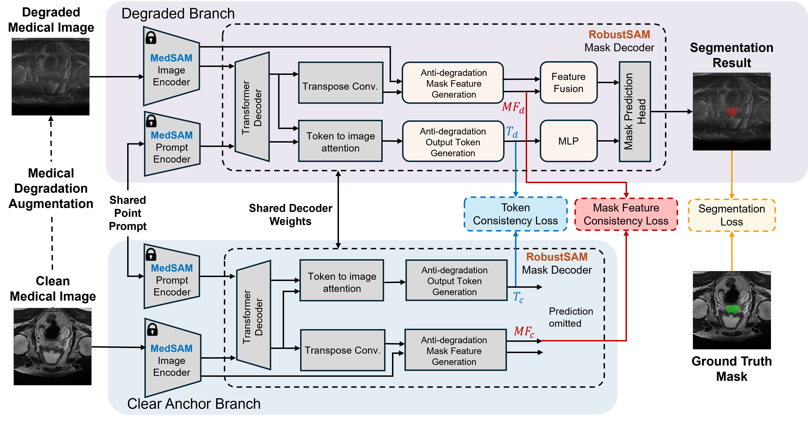

# RobustMedSAM

**Degradation-Resilient Medical Image Segmentation via Robust Foundation Model Adaptation**

Jieru Li, Matthew Chen, Micky C. Nnamdi, J. Ben Tamo, Benoit L. Marteau, May D. Wang
*Georgia Institute of Technology*

> 🎉 **Accepted at the CVPR 2026 CV4Clinic Workshop (Oral).**

[](https://arxiv.org/abs/2604.09814v1)

> Medical image segmentation models built on the Segment Anything Model (SAM)
> perform well on clean benchmarks but degrade under realistic image
> corruptions (noise, blur, motion artifacts, modality-specific distortions).
> RobustMedSAM observes that two needed capabilities live in *different* SAM
> modules — the **image encoder** preserves medical priors, while the **mask
> decoder** governs corruption robustness — and composes them via **module-wise
> checkpoint fusion**: initialize the image/prompt encoder from **MedSAM** and
> the mask decoder from **RobustSAM** (shared ViT-B), then fine-tune **only the
> mask decoder** with a clean–degraded consistency objective while keeping the
> rest frozen. On MedSegBench (35 datasets, 6 modalities, 12 corruption types),
> this improves degraded-image Dice from 0.613 to 0.719 (+0.106) over SAM.

<p align="center">
  
</p>

<p align="center">
  <em>Overview of RobustMedSAM. Each medical image is paired with a degraded
  counterpart via medical degradation augmentation. Both views share the frozen
  MedSAM image and prompt encoders and are decoded by a shared robust decoder
  initialized from RobustSAM. Finetuned modules are highlighted in color; frozen
  modules are gray. At inference, RobustMedSAM needs only a single input image
  with no clean reference.</em>
</p>

---

## Method overview

RobustMedSAM has three parts (see the paper, Sec. 3):

1. **Module-wise mixed initialization.** `θ_encoder ← MedSAM`, `θ_prompt ← MedSAM`,
   `θ_decoder ← RobustSAM`. Built with [`create_mixed_checkpoint.py`](create_mixed_checkpoint.py).
2. **Robustness-aware decoder fine-tuning.** Each clean image `x_c` is paired
   with a degraded view `x_d = T(x_c)` sharing one ground-truth mask. Both views
   share the frozen encoder/prompt-encoder; only the decoder is trained. The
   loss combines:
   - **Segmentation** (Dice + Focal) on the degraded branch,
   - **Mask-feature consistency** (MSE between clean/degraded mask features),
   - **Token consistency** (MSE between clean/degraded output tokens).

   Implemented in [`engine.py`](engine.py) and [`loss.py`](loss.py) with weights
   `focal=20, dice=1, token=2, embedding=100` (paper: α=20, β=1, λ₁=100, λ₂=2).
3. **(Optional) SVD-based encoder adaptation** — freeze the orthogonal bases of
   encoder conv weights and train only the singular values (paper Sec. 3.4).

At inference, RobustMedSAM needs only a single input image (no clean reference).

---

## Setup

```bash
conda create -n robustmedsam python=3.10 -y
conda activate robustmedsam

# install torch matching your CUDA, e.g.:
pip install torch torchvision --index-url https://download.pytorch.org/whl/cu121
pip install -r requirements.txt
```

### Pretrained checkpoints (download separately)

| Component | Source |
|-----------|--------|
| MedSAM ViT-B (`medsam_vit_b.pth`) | https://github.com/bowang-lab/MedSAM |
| RobustSAM ViT-B (`robustsam_checkpoint_b.pth`) | https://huggingface.co/robustsam/robustsam |

Then build the RobustMedSAM initialization checkpoint:

```bash
python create_mixed_checkpoint.py \
    --medsam     medsam_vit_b.pth \
    --robustsam  robustsam_checkpoint_b.pth \
    --output     robustmedsam_init_b.pth
```

---

## Data preparation

RobustMedSAM trains on **[MedSegBench](https://medsegbench.github.io/)**
(35 datasets, 6 modalities). Export the images/masks to the layout below, then
synthesize the degraded views.

```
data/all_data/<split>/clear/*.jpg      # clean medical images
data/all_data/<split>/masks/*.npy      # instance masks (one .npy per image)
```

```bash
cd data
bash gen_data.sh        # creates one folder per degradation next to `clear`
```

The 12 corruption types and their parameters are defined in
[`data/augment.py`](data/augment.py) and follow the degradation protocol in the
paper: Gaussian noise, Gaussian blur, contrast, brightness (modality-agnostic),
plus compression, color jitter, Poisson noise, speckle noise, salt-and-pepper
noise, Rician noise, Rayleigh noise, and step-motion (MRI) artifacts.

---

## Training

Fine-tune the mask decoder (DDP, ViT-B) starting from the mixed checkpoint:

```bash
python -m torch.distributed.launch train_ddp.py \
    --multiprocessing-distributed \
    --exp_name robustmedsam_vitb \
    --model_size b \
    --load_model robustmedsam_init_b.pth \
    --data_dir data/all_data \
    --epochs 10 --batch_size 4 --lr 1e-4 --num_points 3
```

Checkpoints are written to `checkpoints/<exp_name>_best.pth` and
`_last.pth`. Training settings match the paper: ViT-B backbone, frozen
encoder/prompt-encoder, Adam (lr 5e-4 in the paper; 1e-4 default here), 10
epochs, images resized to 512×512.

---

## Inference demo

```bash
# point prompts
python eval.py --model_size b --checkpoint_path checkpoints/robustmedsam_vitb_best.pth

# box prompts
python eval.py --bbox --model_size b --checkpoint_path checkpoints/robustmedsam_vitb_best.pth
```

Results are saved under `demo_result/`.

---

## Citation

```bibtex
@article{li2026robustmedsam,
  title={RobustMedSAM: Degradation-Resilient Medical Image Segmentation via Robust Foundation Model Adaptation},
  author={Li, Jieru and Chen, Matthew and Nnamdi, Micky C and Tamo, J Ben and Marteau, Benoit L and Wang, May D},
  journal={arXiv preprint arXiv:2604.09814},
  year={2026}
}
```

## Acknowledgements

RobustMedSAM builds on
[SAM](https://github.com/facebookresearch/segment-anything),
[MedSAM](https://github.com/bowang-lab/MedSAM), and
[RobustSAM](https://robustsam.github.io/) (CVPR 2024), and is evaluated on
[MedSegBench](https://medsegbench.github.io/). The
`robust_med_segment_anything/` package is adapted from RobustSAM/SAM; see
[LICENSE](LICENSE) for third-party notices.

## License

Released under the [MIT License](LICENSE). 
